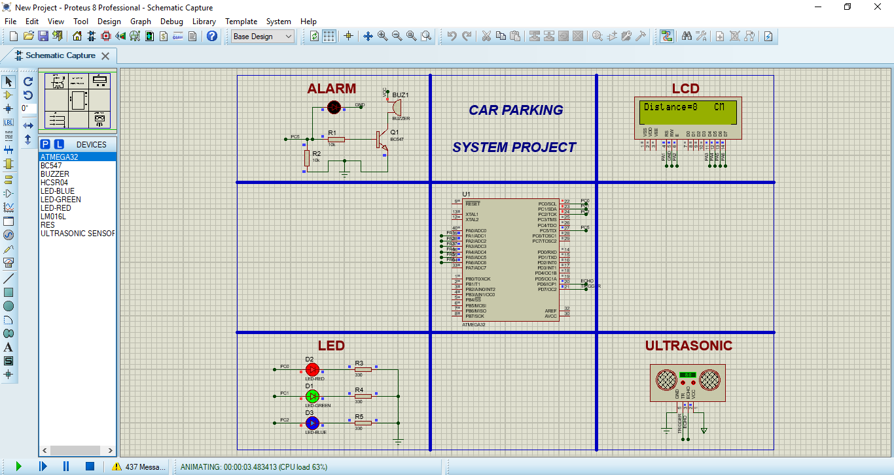

# 🚗 Car Parking Sensor Using ATmega32

A smart car parking sensor system that helps drivers detect obstacles and avoid collisions using an ultrasonic sensor. The system displays distance on an LCD and provides visual and audible alerts using LEDs and a buzzer.

---

## 📌 Project Overview

This project uses an ATmega32 microcontroller to measure the distance between the car and obstacles using an HC-SR04 ultrasonic sensor.  
The distance is displayed on a 16x2 LCD, while RGB LEDs and a buzzer provide warning indications based on proximity.

---

## ✨ Features

- 📏 Ultrasonic Distance Measurement
- 📺 LCD Display
  - Displays distance in centimeters.
  - Displays "STOP" when distance ≤ 5 cm.
- 💡 LED Indicators
  - LEDs turn ON/OFF based on distance range.
- 🔊 Buzzer Alert
  - Activates when distance ≤ 5 cm.
- ⚡ Real-Time Update

---

## 🚦 Distance Behavior Mapping

| Distance Range | LEDs Status | Buzzer | LCD |
|----------------|-------------|---------|------|
| ≤ 5 cm          | All LEDs Flashing | ON | STOP |
| 6 – 10 cm       | All LEDs ON | OFF | Distance |
| 11 – 15 cm      | Red + Green | OFF | Distance |
| 16 – 20 cm      | Red Only | OFF | Distance |
| > 20 cm         | All OFF | OFF | Distance |

---

## 🧩 Hardware Components

- ATmega32 Microcontroller  
- HC-SR04 Ultrasonic Sensor  
- 16x2 LCD (4-bit mode)  
- RGB LEDs  
- Buzzer  

---

## 🔌 Pin Configuration

### LCD
- RS → PA1  
- E → PA2  
- D4–D7 → PA3–PA6  
- RW → GND  

### Ultrasonic Sensor
- Trigger → PD7  
- Echo → PD6  

### LEDs
- Red → PC0  
- Green → PC1  
- Blue → PC2  

### Buzzer
- PC5  

---

## 🧠 Software Architecture

Layered Driver Architecture:
- Application Layer
- HAL Drivers: LCD, LED, Buzzer, Ultrasonic
- MCAL Drivers: GPIO, ICU

---

## 🖼️ Project Images

### 🔧 System Architecture

### ⚡ Proteus Simulation

---

## 🛠️ Tools

- Microcontroller: ATmega32
- IDE: Eclipse / AVR-GCC
- Simulation: Proteus 8
- Language: C

